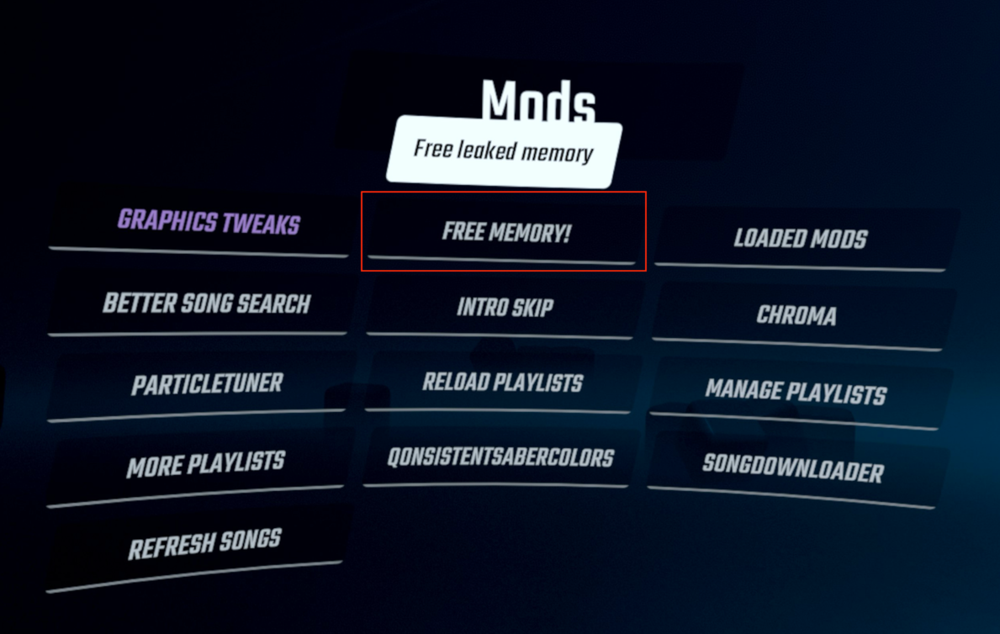

# `FreeMemory` Beat Saber Mod

One-click memory cleanup for Beat Saber on Quest.
If your game starts feeling heavy after long sessions, this mod gives you a fast way to reclaim memory without restarting.

## Why Use It
- Adds a `Free Memory!` button to the main menu.
- Runs a best-effort cleanup pass:
  - Managed GC sweep
  - `Resources::UnloadUnusedAssets`
  - Native heap trim (`malloc_trim` when available)
- Shows `DONE!` in-game when cleanup finishes.

## Compatibility
- Game: Native Quest Beat Saber (currently supports `1.37.0_9064817954` only)
- Mod loader: Scotland2
- QMod dependencies: BSML, custom-types, paper

## How To Use
1. Install `FreeMemory.qmod` with your usual Quest mod manager.
2. Launch Beat Saber.
3. In the main menu, press `Free Memory!`.
4. Wait until you see `DONE!`.

## Practical Notes
- This is a best-effort cleanup tool, not a guaranteed crash fix.
- Expect a brief hitch while unused assets are unloaded.
- Repeated taps are ignored while a cleanup pass is already running.

## Build / Package (Developers)
- `qpm s build` build the mod.
- `qpm s clean` rebuild from a clean path.
- `qpm s qmod` package `FreeMemory.qmod`.
- `qpm s copy` copy to headset and restart Beat Saber with logging.
- `qpm s deepclean` remove build artifacts and downloaded dependencies.
